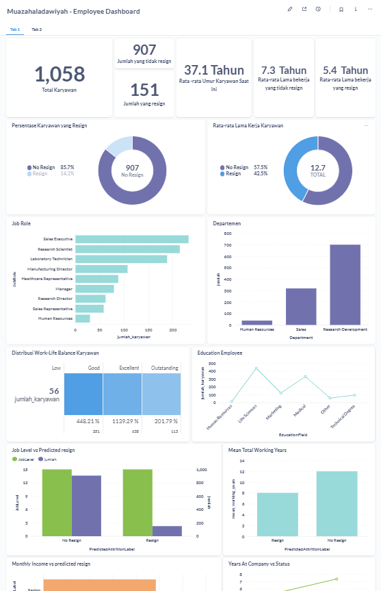

# Proyek Akhir: Menyelesaikan Permasalahan Perusahaan Edutech

## Business Understanding
Jaya Jaya Maju merupakan salah satu perusahaan multinasional yang telah berdiri sejak tahun 2000. Ia memiliki lebih dari 1000 karyawan yang tersebar di seluruh penjuru negeri. 

Seiring pertumbuhan bisnisnya, perusahaan menghadapi tantangan besar dalam mempertahankan karyawan. Perusahaan Jaya Jaya Maju ini masih cukup kesulitan dalam mengelola karyawan. Hal ini berimbas tingginya attrition rate (rasio jumlah karyawan yang keluar dengan total karyawan keseluruhan) hingga lebih dari 10%.

Tingginya tingkat attrition (pengunduran diri karyawan) mengakibatkan tingginya biaya rekrutmen dan pelatihan, produktivitas tim yang menurun karena kehilangan tenaga kerja yang berpengalaman, serta terganggunya stabilitas tim dan produktivitas organisasi. 

Oleh karena itu, perusahaan perlu melakukan analisa untuk mengidentifikasi berbagai faktor yang mempengaruhi tingginya attrition rate tersebut dan memprediksi kemukinan terjadinya karyawan mengundurkan diri secara proaktif. Dengan memanfaatkan data historis karyawan dan menerapkan model machine learning, diharapkan dapat memberikan solusi yang efektif dan strategis dalam mengatasi permasalahan tersebut dan menjadi pengambilan keputusan HR dalam meningkatkan kualitas lingkungan kerja dan mengurangi risiko kehilangan talenta terbaik di perusahaan.

### Permasalahan Bisnis
Perusahaan Jaya Jaya Maju menghadapi beberapa tantangan nyata dalam pengelolaan karyawan, antara lain:
- Manajemen HR kesulitan dalam mengidentifikasi faktor utama penyebab pengunduran diri karyawan. Tidak adanya pemahaman menyeluruh tentang faktor internal atau eksternal yang berkontribusi terhadap attrition menyulitkan HR dalam merancang strategi retensi yang efektif.
- Pengelolaan karyawan yang belum optimal, sehingga HR kesulitan dalam menjaga keterlibatan dan kepuasan kerja karyawan. Hal ini menyebabkan menurunnya motivasi dan berujung pada keputusan pengunduran diri.
- Pengambilan keputusan HR masih bersifat reaktif dan intuitif. Tanpa dukungan data dan analitik, intervensi yang dilakukan tidak selalu tepat sasaran, sehingga meningkatkan risiko kehilangan karyawan potensial dan berbakat.
- Sistem informasi HR yang masih terbatas menghambat transparansi data terkait kinerja dan kepuasan karyawan, sehingga strategi pengembangan dan retensi karyawan kurang tepat sasaran.
- Belum tersedia sistem pemantauan yang terintegrasi, efisien, dan real-time untuk mengevaluasi kesejahteraan, beban kerja, serta perkembangan karier karyawan secara menyeluruh. Kondisi ini menyulitkan HR dalam mendeteksi dan mengambil tindakan preventif terhadap risiko penurunan motivasi dan potensi pengunduran diri karyawan secara dini.

Tujuan:
- Mengidentifikasi faktor-faktor yang secara signifikan memengaruhi keputusan karyawan untuk keluar dari perusahaan Jaya Jaya Maju.
- Mengembangkan model prediktif untuk mengidentifikasi karyawan dengan risiko tinggi attrition.
- Menyediakan dashboard interaktif agar digunakan HR untuk memantau kondisi tenaga kerja secara real-time dan menjadi pengambilan keputusan berbasis data.

Seluruh Permasalahan Bisnis yang Diselesaikan (Goals):
- Memprediksi karyawan yang memiliki potensi untuk mengundurkan diri (resign) secara lebih akurat.
- Menyajikan visualisasi data yang menggambarkan faktor-faktor risiko utama seperti usia, gaji, masa kerja, dan jenjang karir yang berpengaruh terhadap keputusan resign.
- Memberikan rekomendasi tindakan preventif yang tepat berdasarkan hasil analisis data untuk meningkatkan retensi karyawan.

### Cakupan Proyek
- Eksplorasi dan pembersihan data HR karyawan.
- Transformasi data (handling missing values, outliers, encoding, scaling, log transformasi untuk fitur skewed).
- Pemodelan prediksi attrition menggunakan beberapa model ML (Logistic Regression, Decision Tree, Random Forest, XGBoost, dan Neural Network).
- Evaluasi model dengan metrik klasifikasi seperti accuracy, precision, recall, dan F1-score.
- Integrasi hasil analisis ke dalam dashboard interaktif menggunakan Metabase dan Streamlit sebagai alat bantu pengambilan keputusan.

### Persiapan

Sumber data : [Employee Data](https://github.com/dicodingacademy/dicoding_dataset/tree/main/employee).<br>
Data diambil dari Dataset internal dari Jaya Jaya Maju terkait informasi demografis dan pekerjaan karyawan. 

Berikut penjelasan mengenai fitur yang akan diambil : 
* **EmployeeId** - Employee Identifier
* **Attrition** - Did the employee attrition? (0=No, 1=Yes)
* **Age** - Age of the employee
* **BusinessTravel** - Travel commitments for the job
* **DailyRate** - Daily salary
* **Department** - Employee Department
* **DistanceFromHome** - Distance from work to home (in km)
* **Education** - 1-Below College, 2-College, 3-Bachelor, 4-Master,5-Doctor
* **EducationField** - Field of Education
* **EnvironmentSatisfaction** - 1-Low, 2-Medium, 3-High, 4-Very High
* **Gender** - Employee's gender
* **HourlyRate** - Hourly salary
* **JobInvolvement** - 1-Low, 2-Medium, 3-High, 4-Very High
* **JobLevel** - Level of job (1 to 5)
* **JobRole** - Job Roles
* **JobSatisfaction** - 1-Low, 2-Medium, 3-High, 4-Very High
* **MaritalStatus** - Marital Status
* **MonthlyIncome** - Monthly salary
* **MonthlyRate** - Mounthly rate
* **NumCompaniesWorked** - Number of companies worked at
* **Over18** - Over 18 years of age?
* **OverTime** - Overtime?
* **PercentSalaryHike** - The percentage increase in salary last year
* **PerformanceRating** - 1-Low, 2-Good, 3-Excellent, 4-Outstanding
* **RelationshipSatisfaction** - 1-Low, 2-Medium, 3-High, 4-Very High
* **StandardHours** - Standard Hours
* **StockOptionLevel** - Stock Option Level
* **TotalWorkingYears** - Total years worked
* **TrainingTimesLastYear** - Number of training attended last year
* **WorkLifeBalance** - 1-Low, 2-Good, 3-Excellent, 4-Outstanding
* **YearsAtCompany** - Years at Company
* **YearsInCurrentRole** - Years in the current role
* **YearsSinceLastPromotion** - Years since the last promotion
* **YearsWithCurrManager** - Years with the current manager

Setup environment:
1. Pengaturan Virtual Environtment
- Membuat dan mengaktifkan Env
    - Windows :
        ```
        python -m venv venv
        .\venv\Scripts\activate
        ```
    - Linux/MacOS: :
        ```
        python3 -m venv venv
        source venv/bin/activate
        ```
- Menginstal Dependensi<br>
    - Install menggunakan pip pada file requirements.txt
        ```
        pip install -r requirements.txt
        ```
- Jupyter Notebook
    - Install dan Menjalankan Jupyter 
        ```
        pip install jupyter
        jupyter notebook
        ```
- Menjalankan Model
    - Menjalankan model untuk prediksi
        ```
        python prediction.py
        ```

    - menyimpan hasil prediksi ke database PostgreSQL di superbase ke metabase
        ```
        python main.py
        ```
- Menjalankan Metabase dengan Docker
    - Pull docker image metabase
        ```
        docker pull metabase/metabase
        ```
    - Jalan metabase
        ```
        docker run -d -p 3000:3000 --name metabase metabase/metabase
        ```
        ```
        docker-compose up -d / docker-compose start
        ```
    - Cek log container untuk memastikan metabase berhasil
        ```
        docker logs c9cf13c6d7118
        ```
    - Cek container yang sedang berjalan
        ```
        docker ps
        ```
        akan muncul : [Browser](http://localhost:3001), tunggu sekitar 1/2 menit refresh
    - Akun Sign in to Metabase
        ```
        username = root@mail.com
        password = roots12345
        ```

- Menonaktifkan Layanan dengan Docker
    - Menghentikan Docker Containers
        - Metabase : 
            ```
            docker-compose stop
            ```
    - Menghapus Docker Containers setelah selesai
        - Metabase : 
            ```
            docker rm metabase
            ```
    - Streamlit : 
        ```
        streamlit run main.py
        ```
## Business Dashboard



Dashboard yang dikembangkan mencakup:
- Distribusi karyawan keluar dan bertahan.
- Filter interaktif berdasarkan jabatan, departemen, dan usia pada website streamlit<br>
    Dimana dengan adanya filter ini kita bisa melihat karyawan yang akan resign sesuai jabatan maupun departemen. dan kita juga bisa melihat detail karyawan tersebut.
- Visualisasi faktor-faktor signifikan seperti Monthly Income, Total Working Years, dan YearsAtCompany. <br>
    Kita bisa melihat persentase dan hubungan antara faktor yang mempengaruhi karyawan tersebut resign dengan menganalisa visualisasi yang ada.

Link Dashboard (Metabase): [Dashboard Metabase](http://localhost:3001/public/dashboard/e0b4c229-d46f-4f02-b5df-9a8d364cc3d5)<br>
Link Aplikasi Prediksi (Streamlit): [Dashboard Streamlit](https://datascience1-zncw9kwsqtthb5qb69kftz.streamlit.app/)

## Conclusion

Berdasarkan hasil eksplorasi data dan pemodelan yang telah dilakukan terhadap data karyawan PT Jaya Jaya Maju, dapat disimpulkan bahwa:
- Tingkat attrition (resign) karyawan di perusahaan cukup signifikan dan perlu perhatian khusus dari divisi HR.
- Berdasarkan analisis eksploratif (EDA), terdapat beberapa faktor yang paling berkontribusi terhadap tingginya risiko attrition, yaitu:
    - Pendapatan bulanan (Monthly Income),
    - Jarak rumah ke kantor (Distance From Home),
    - Jumlah perusahaan sebelumnya (NumCompaniesWorked),
    - Lama bekerja di perusahaan saat ini (YearsAtCompany),
    - dan Jumlah tahun bekerja secara total (TotalWorkingYears).
- Setelah melakukan training dan evaluasi pada lima model klasifikasi (Logistic Regression, Decision Tree, Random Forest, XGBoost, dan Neural Network/MLP), model Random Forest menunjukkan performa terbaik dengan hasil evaluasi di data uji sebagai berikut:
    - Accuracy: tinggi (misalnya, ~85.8%)
    - Precision dan Recall: seimbang, menunjukkan kemampuan model dalam mengenali karyawan yang berpotensi keluar cukup andal
    - F1-Score: konsisten tinggi, artinya model mampu menangani class imbalance dengan baik.
    
    Oleh karena itu, Random Forest dipilih sebagai model final untuk memprediksi kemungkinan karyawan akan keluar dari perusahaan (attrition prediction). Model ini kemudian digunakan untuk memprediksi data baru dan hasilnya diintegrasikan ke dalam dashboard monitoring HR.

### Rekomendasi Action Items (Optional)

Beberapa rekomendasi action items yang harus dilakukan perusahaan guna menyelesaikan permasalahan atau mencapai target mereka yaitu :
1. Evaluasi dan Optimalkan Paket Kompensasi
    - Tingkatkan Penghasilan bagi karyawan dengan penghasilan rendah yang berisiko tinggi untuk resign, terutama pada mereka yang telah bekerja selama beberapa tahun dan memiliki pengalaman yang signifikan.
    - Mengidentifikasi faktor-faktor yang berhubungan dengan pemberian bonus atau insentif yang bisa meningkatkan loyalitas.

2. Perbaiki Work-Life Balance
    - Menyediakan kebijakan fleksibilitas jam kerja atau kerja jarak jauh untuk karyawan yang tinggal jauh dari kantor, guna mengurangi ketidaknyamanan dalam hal Distance From Home.
    - Menyediakan program wellness dan kesehatan mental untuk meningkatkan kepuasan kerja dan mengurangi stres yang mungkin berkontribusi pada keputusan untuk keluar.

3. Penyuluhan tentang Karier dan Peluang Kenaikan Jabatan
    - Meningkatkan program pelatihan dan pengembangan karier, dengan memberi kesempatan kepada karyawan untuk mengembangkan keterampilan dan membangun jalur karier jangka panjang.
    - Menawarkan program rotasi jabatan untuk mereka yang merasa stagnan setelah bekerja beberapa tahun (misalnya YearsAtCompany).

4. Pendekatan Proaktif pada Karyawan Baru
    - Fokus pada onboarding program yang lebih efektif untuk karyawan baru guna meminimalkan turnover dalam beberapa bulan pertama.
    - Memperkenalkan karyawan baru dengan mentorship dari karyawan senior untuk mempercepat integrasi mereka ke dalam budaya perusahaan.

5. Peningkatan Kepuasan Kerja
    - Berdasarkan faktor-faktor yang berhubungan dengan JobSatisfaction dan JobInvolvement, perusahaan dapat mengidentifikasi area di mana kebijakan atau fasilitas perlu ditingkatkan.
    - Meningkatkan komunikasi antara manajer dan tim untuk memastikan karyawan merasa dihargai dan memiliki peluang untuk memberikan umpan balik.

6. Gunakan dashboard sebagai alat monitoring berkala oleh divisi HR dan manajemen.

Dengan mengimplementasikan action items ini, perusahaan dapat memitigasi faktor-faktor yang mempengaruhi keputusan resign, serta menciptakan lingkungan kerja yang lebih menarik bagi karyawan yang ada dan potensi karyawan yang baru.